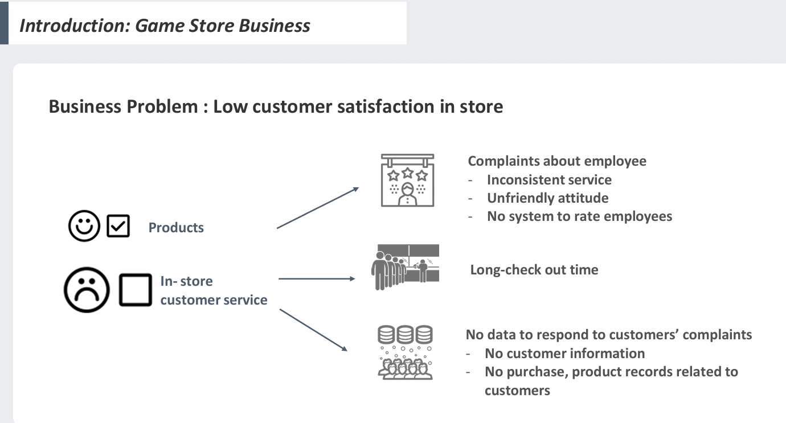
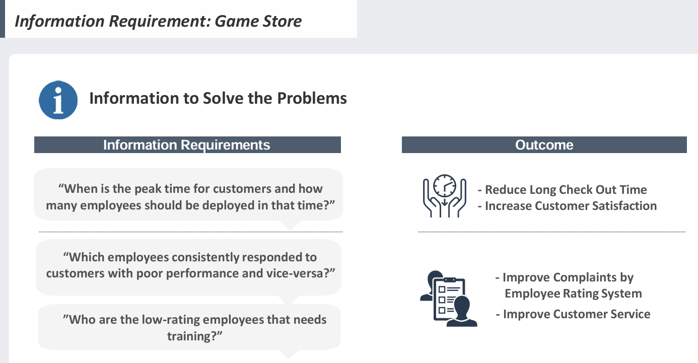
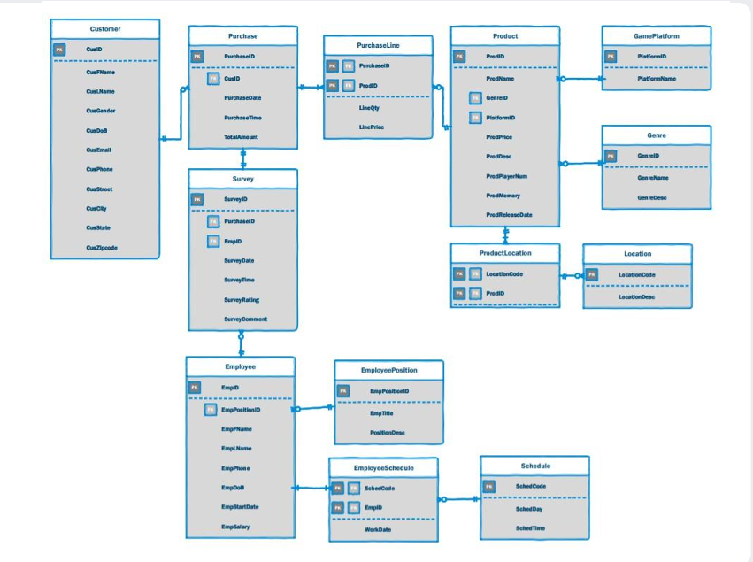

# Game-Store-Optimizer


# Database_Project
This is a project that explains how I used SQL for a database design.

## Background



Game Store, a console games retailer, has shown a rapid growth since its start of business. As it grew, the store faced a number of challenges related to low customer satisfaction. Customers were complaining about in-store customer service, however, the current data held by the business could not generate any meaningful insights and also could not load any data related to solve the problem. To solve the problem, the business needed information generated by customers, transactions, products, product display, employee, employee schedule and employee rating data. With the new database system, the ABC game store was able to yield meaningful reports. Through the proposed database, the business can generate monthly sales reports based on customer information, monthly reports on employees’ customer service assessment, and report on peak hours and the current situation. These reports can facilitate the building of a positive customer in-store experience. 



According to DBLC, the database for the business is in the fourth phase, testing and evaluation. The project has finished initial study, design, and implementation and loading phase and needs to take further actions in testing and evaluation, operation, and maintenance and evolution phase. The database needs to iteratively make improvements to address problems occurring.  Iteration of the updating the database will eliminate the bottlenecks of ABC game store business and potentially impact on creating additional economic values and securing customer loyalty.

## Build with
● pgadminSQL

## Key skills learned
● Software Development Life Cycle 
● SQL Quereis (groupby)
● Crow's foot erd

## ERD



## Query

Query 1) Total Number of Purchase
```
SELECT Product.ProdID, ProdName, GenreID, COUNT(PurchaseLine.PurchaseID) AS Total_Num_of_Purchase
FROM Product, Customer, Purchase, PurchaseLine
WHERE Product.ProdID=PurchaseLine.ProdID 
AND Customer.CusID=Purchase.CusID 
AND Purchase.PurchaseID=PurchaseLIne.PurchaseID 
AND purchasedate >= '1/1/2021' 
AND purchasedate < '1/31/2021'
GROUP BY Product.ProdID, ProdName, GenreID;
```

Query 2) Purchase of Male Customers
```
SELECT Product.ProdID, ProdName, GenreID, CusGender, COUNT(PurchaseLine.PurchaseID) AS Total_Num_of_Purchase
FROM Product, Customer, Purchase, PurchaseLine
WHERE Product.ProdID=PurchaseLine.ProdID 
AND Customer.CusID=Purchase.CusID 
AND Purchase.PurchaseID=PurchaseLIne.PurchaseID 
AND CusGender='M' 
AND purchasedate >= '1/1/2021' 
AND purchasedate < '1/31/2021'
GROUP BY Product.ProdID, ProdName, GenreID, CusGender;
```

Query 3) Purchase of Female Customers
```
SELECT Product.ProdID, ProdName, GenreID, CusGender, COUNT(PurchaseLine.PurchaseID) AS Total_Num_of_Purchase
FROM Product, Customer, Purchase, PurchaseLine
WHERE Product.ProdID=PurchaseLine.ProdID 
AND Customer.CusID=Purchase.CusID 
AND Purchase.PurchaseID=PurchaseLIne.PurchaseID 
AND CusGender='F' 
AND PurchaseDate >= '1/1/2021' 
AND PurchaseDate < '1/31/2021'
GROUP BY Product.ProdID, ProdName, GenreID, CusGender;
```

Query 4) Purchase of Customers Over age 30 
```
SELECT Product.ProdID, ProdName, GenreID, COUNT(PurchaseLine.PurchaseID) AS Total_Num_of_Purchase
FROM Product, Customer, Purchase, PurchaseLine
WHERE Product.ProdID=PurchaseLine.ProdID 
AND Customer.CusID=Purchase.CusID 
AND Purchase.PurchaseID=PurchaseLIne.PurchaseID 
AND CusDoB <= '12/31/1991' 
AND PurchaseDate >= '1/1/2021' 
AND PurchaseDate < '1/31/2021'
GROUP BY Product.ProdID, ProdName, GenreID;
```

Query 5) Find each employees’ average score and name and create ‘employee_avg_score’ table
```
CREATE TABLE employee_avg_score AS (
SELECT EMPLOYEE.EmpFName, Count(SURVEY.SurveyID) AS CountOfSurvey, Avg(SurveyRating) AS AvgOfRating, 
Count(SURVEY.SurveyComment) AS CountOfComment
FROM SURVEY, EMPLOYEE
WHERE SURVEY.EmpID = EMPLOYEE.EmpID 
AND SurveyDate >= '1/1/2021' 
AND SurveyDate <= '1/31/2021'
GROUP BY EMPLOYEE.EmpFName
ORDER BY EMPLOYEE.EmpFName
);	
```

Query 6) TOtal number of purchase in January, 2021
```
SELECT Product.ProdID, ProdName, GenreID, COUNT(PurchaseLine.PurchaseID) AS Total_Num_of_Purchase
FROM Product, Customer, Purchase, PurchaseLine
WHERE Product.ProdID=PurchaseLine.ProdID 
AND Customer.CusID=Purchase.CusID 
AND Purchase.PurchaseID=PurchaseLIne.PurchaseID 
AND PurchaseDate >= '1/1/2021'
AND PurchaseDate <= '1/31/2021'
GROUP BY Product.ProdID, ProdName, GenreID;
```


## Conclusion

●	Defined 5 database issues that caused a bottleneck to improve customer experience and designed 13 relational database models with ERD to solve the business backlog by designing a SQL database.
●	Created a Customer Relationship Management (CRM) database model by applying analytical approaches which are projected to create $10 million in value to the local economy.
● Enable to understand the software development life cycle and set up future action plan


Integration and expansion of the database system can provide an essential framework for more effective marketing measures. While ABC game store’s spreadsheet is only able to track total transactions, the proposed database system can analyze customers' purchase patterns, types, and complaints through the closely connected relational table. By combining with the stored customer information and employee's rating, come up with measures to prevent the losing customer or increase the store revisit rate. However, Customer Relationship Management activities will be successful only when the data is finely maintained and kept updated. In particular, to use basic customer data to accurately continuously update the data in the database, and associate cleansing tools to the database are necessary. As the business expands, the database may need to introduce additional business rules or expand and restrict employees' access to the database. In order for the database to respond flexibly to these situations, only iterative evaluation and revision are the way to get closer to the complete Database Life Cycle.

Intuitively, most people recognize the value of a great customer experience. The brand which provides this value is the brand that the customer is willing to interact with. According to Harvard Business Review, customers who have the best customer experiences spend 140% more than customers with the worst experiences. While customers who are not satisfied with the customer service will only increase by 40% sales per customer and there is little potential for revisiting the store. (Kriss The Value of Customer Experience, Quantified)

The introduction of ABC Game Store's new database is expected to eliminate bottlenecks in existing revenue structures and will bring additional 140% revenue growth potential, while enabling improved quality of customer service and systematic management of human resources.

